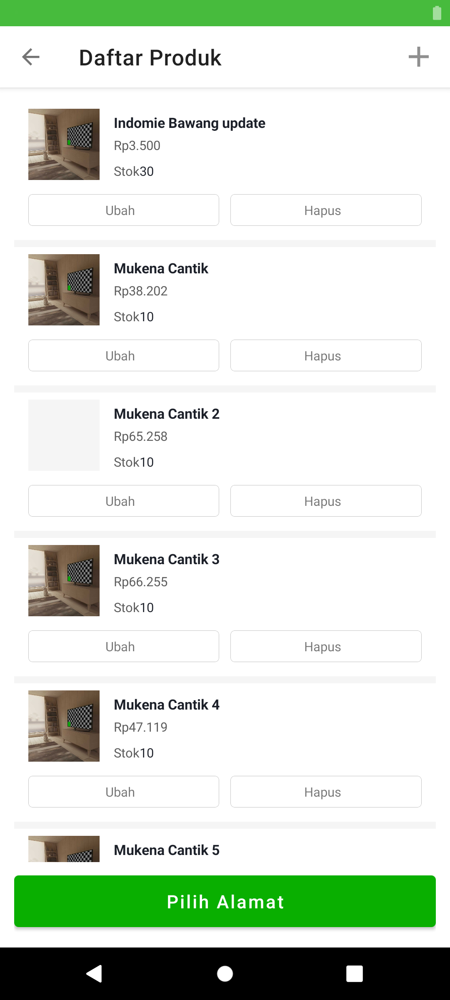

# APLIKASI MARKETPLACE TOPEDIA (CLONING TOKOPEDIA) DENGAN ANDROID KOTLIN

Teknologi Yang digunakan

1. Kotlin
2. ViewModel
3. Dependency Injection With Koin Android
4. ViewBinding
5. Bottom Navigation
6. Retrofit
7. Shared Preferences

### Screenshoot:

|    |    |
|:-----------------------------------:|:-----------------------------------:|
|    |  |
| :---------------------------------: | :---------------------------------: |
|    |    |
| :---------------------------------: | :---------------------------------: |
|    |    |
| :---------------------------------: | :---------------------------------: |
|    |    |
| :---------------------------------: | :---------------------------------: |
|    |  |
| :---------------------------------: | :---------------------------------: |
|    |    |

